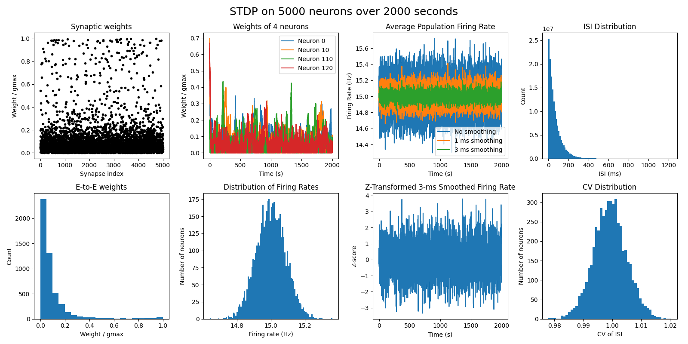

# STDP in Brian2

## Usage

### Setting up environment
```
python -m venv .venv
source .venv/bin/activate
pip install --upgrade pip
pip install -r requirements
```

### Running my Brian2 STDP Python code
```
python Brian2-STDP.py --neurons <number of neurons> --run_length <simulation time in seconds>
```

## Results
[](STDP_results_5000_2000.pdf)
